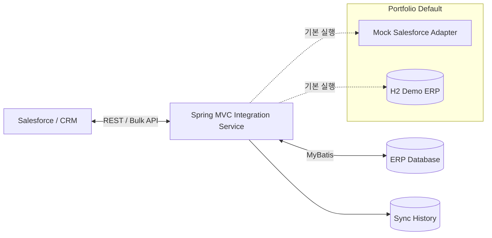
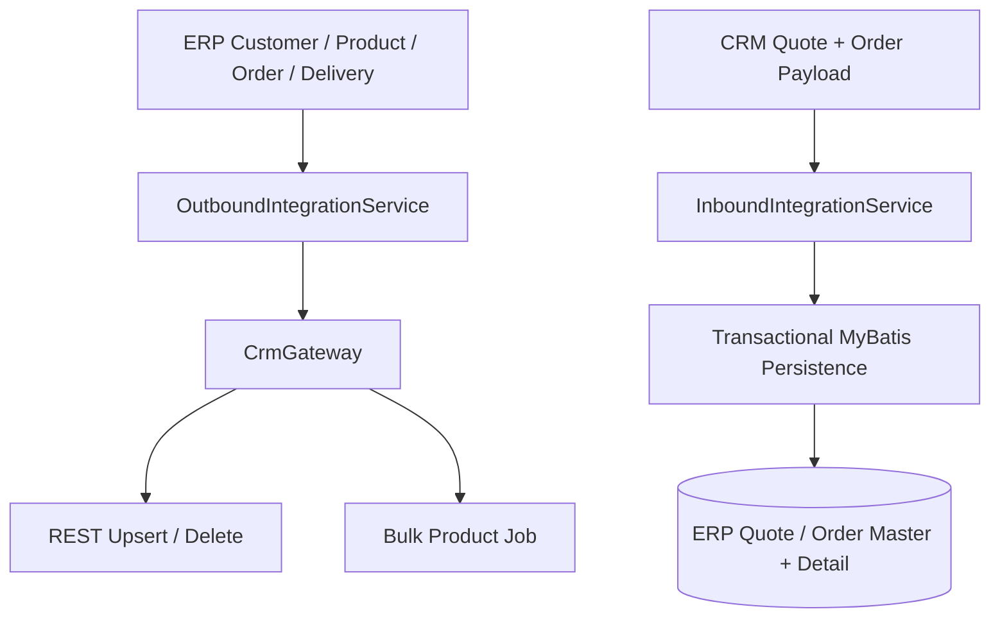
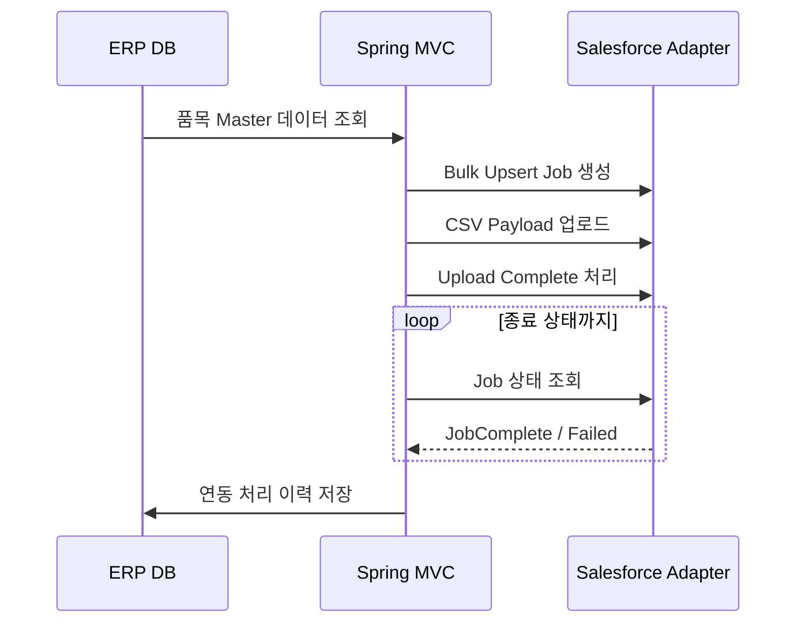
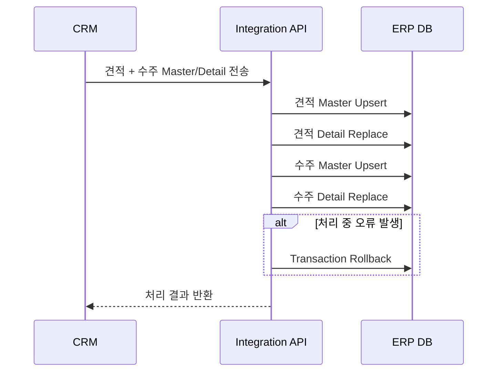

# ERP ↔ Salesforce 연동 플랫폼

> **Spring MVC + MyBatis 기반 ERP–CRM 시스템 연동 프로젝트를 포트폴리오 용도로 재구성한 공개 프로젝트입니다.**

이 저장소는 회사의 원본 소스코드를 복사한 프로젝트가 아닙니다. 실제 기업 프로젝트에서 경험한 ERP–CRM 연동 방식과 기술적 구조를 바탕으로 공개용으로 새롭게 구현했습니다. 회사명, 내부 DB 객체, Stored Procedure, 내부 URL, 계정정보, 고객 데이터, Salesforce 조직별 메타데이터 등은 포함하지 않습니다.

## 프로젝트에서 보여주는 역량

- 화면에 의존하지 않는 **ERP ↔ CRM 양방향 시스템 연동**
- Spring Boot가 아닌 **Spring Framework / Spring MVC** 기반 WAR 애플리케이션 구성
- **MyBatis** 기반 ERP 데이터 조회 및 Master/Detail Transaction 처리
- External Key를 이용한 CRM **REST Upsert / Delete**
- Job Lifecycle을 고려한 **Bulk API 방식의 대량 품목 동기화**
- 외부 CRM 구현과 업무 로직을 분리한 **Gateway / Adapter 구조**
- 연동 처리 이력을 통한 추적성 확보
- 별도 외부 시스템 없이 실행할 수 있는 **H2 Demo ERP + Mock Salesforce** 환경
- Spring Profile 및 환경변수로만 활성화되는 선택적 Salesforce HTTP Adapter

## Architecture



### 연동 방향



## 주요 연동 흐름

### 1. ERP → CRM 품목 대량 동기화

대량 품목 데이터는 건별 REST 호출이 아닌 Bulk Job 방식으로 처리하도록 구성했습니다.



처리 단계는 다음과 같습니다.

```text
ERP 품목 조회
    ↓
Bulk Job 생성
    ↓
CSV 데이터 Upload
    ↓
Upload Complete
    ↓
Job Status Polling
    ↓
JobComplete / Failed
    ↓
연동 결과 기록
```

### 2. CRM → ERP 견적 / 수주 Transaction

CRM에서 전달받은 견적 및 수주 데이터를 ERP의 Master/Detail 구조로 저장합니다. 하나의 요청을 Transaction으로 처리하여 중간 단계에서 오류가 발생할 경우 전체 작업을 Rollback하도록 구성했습니다.



## 기술 스택

| 구분 | 기술 |
| --- | --- |
| Language | Java 11 |
| Framework | Spring Framework 5.3, Spring MVC |
| Persistence | MyBatis 3 |
| Demo DB | H2 (MSSQL Compatibility Mode) |
| Integration | Java HTTP Client, JSON, REST, Bulk API Pattern |
| Build | Maven, WAR |
| Runtime | Jetty Maven Plugin 또는 Tomcat 9 |
| Test | JUnit 5, Spring Test |
| CI | GitHub Actions |

실제 업무 경험은 전통적인 Java/Spring MVC 기반 환경에서 이루어졌으며, 공개용 프로젝트는 로컬 실행 편의성을 위해 Java 11을 기준으로 구성했습니다. 다만 **Spring Boot로 전환하지 않고 Spring MVC + WAR + MyBatis 구조를 의도적으로 유지**했습니다.

## 로컬 실행 방법

### 요구사항

- Java 11 이상
- Maven 3.8 이상

### 테스트 및 실행

```bash
mvn clean test
mvn jetty:run
```

실행 후 아래 API로 정상 동작 여부를 확인할 수 있습니다.

```text
GET http://localhost:8080/api/health
GET http://localhost:8080/api
```

기본 실행 환경에서는 Salesforce 계정이나 외부 DB가 필요하지 않습니다. H2와 `MockSalesforceGateway`를 사용합니다.

## Demo API

### 고객 동기화: ERP → CRM

```bash
curl -X POST http://localhost:8080/api/erp/customers/CUST-1001/sync
```

### 품목 Bulk 동기화: ERP → CRM

```bash
curl -X POST http://localhost:8080/api/erp/products/bulk-sync
```

### 수주 동기화: ERP → CRM

```bash
curl -X POST http://localhost:8080/api/erp/orders/SO-2026-0001/sync
```

### 배송정보 동기화: ERP → CRM

```bash
curl -X POST http://localhost:8080/api/erp/deliveries/DLV-2026-0001/sync
```

### Mock Salesforce 저장 상태 확인

```bash
curl http://localhost:8080/api/demo/crm-state
```

### 연동 처리 이력 확인

```bash
curl http://localhost:8080/api/erp/sync-history
```

CRM → ERP 요청 예시는 [`docs/api.md`](docs/api.md)에서 확인할 수 있으며, 코드 리뷰 시 빠르게 확인할 위치는 [`docs/reviewer-guide.md`](docs/reviewer-guide.md)에 정리했습니다.

## Tomcat 배포

```bash
mvn clean package
```

생성된 아래 WAR 파일을 Tomcat 9에 배포할 수 있습니다.

```text
target/erp-salesforce-integration.war
```

## 실제 Salesforce Adapter 사용

기본 설정에서는 **실제 Salesforce에 연결하지 않습니다.**

`SalesforceHttpGateway`는 Spring Profile `salesforce`를 명시적으로 활성화하고 인증정보를 외부 환경변수로 제공했을 때만 활성화됩니다. OAuth 인증, External ID 기반 REST Upsert/Delete, Bulk API Job Lifecycle 구조를 확인하기 위한 구현이며, 실제 조직에 연결하려면 해당 조직의 Object 및 Field Mapping을 별도로 적용해야 합니다.

Spring Profile 활성화 예시:

```bash
-Dspring.profiles.active=salesforce
```

환경변수 이름은 [`.env.example`](.env.example)을 참고할 수 있습니다. 실제 Credential은 Git에 Commit하지 않습니다.

## Repository 구조

```text
src/main/java/dev/portfolio/integration
├── controller     REST API Endpoint
├── service        연동 흐름 및 Transaction 처리
├── repository     MyBatis Mapper Interface
├── gateway        Mock / Salesforce Adapter
├── model          ERP Domain Model
└── dto            API / Integration DTO

src/main/resources
├── db             Demo ERP Schema / Seed Data
├── mapper         MyBatis SQL Mapping
└── spring         Spring XML Configuration
```

## 주요 설계 포인트

### External ID 기반 Upsert

ERP에서 동일한 데이터가 재전송되더라도 CRM에 중복 객체가 생성되지 않도록 External ID를 기준으로 Upsert하는 구조를 사용했습니다.

### Gateway 추상화

`CrmGateway` 인터페이스를 중심으로 외부 CRM 통신 세부 구현을 Service Layer와 분리했습니다. 기본 실행에서는 Mock 구현체를 사용하고, 실제 Salesforce 연동은 별도의 HTTP 구현체로 분리했습니다.

### REST와 Bulk 처리 분리

건별 데이터와 대량 데이터는 처리 방식과 오류 대응 방식이 다르기 때문에 일반 REST 연동과 Bulk Job 연동을 별도의 흐름으로 구성했습니다.

### Transaction 기반 Inbound 처리

CRM에서 ERP로 전달되는 견적 및 수주 Master/Detail 데이터는 하나의 Transaction으로 처리하여 데이터 정합성을 유지하도록 구성했습니다.

### Sync History

연동 요청의 성공/실패 및 처리 결과를 기록하여 시스템 간 데이터 동기화 문제를 추적할 수 있도록 구성했습니다.

## 공개용 프로젝트 재구성 원칙

이 저장소에는 다음 정보가 포함되어 있지 않습니다.

- 실제 기업의 원본 소스코드
- 회사명 및 고객사 식별정보
- 내부 서버 IP / URL
- 실제 DB 계정 및 비밀번호
- Salesforce Client ID / Client Secret
- 실제 Salesforce Organization 정보
- 고객 개인정보
- 회사 고유 SQL / Stored Procedure
- 회사 고유 Custom Object / Field 이름

공개 저장소 보안 정책에 대한 자세한 내용은 [`SECURITY.md`](SECURITY.md)를 참고해주세요.

## 포트폴리오 설명

이 프로젝트는 **ERP와 Salesforce 간 데이터 연동 업무를 수행했던 경험을 기반으로 재구성한 Integration Backend 포트폴리오**입니다.

화면 중심의 웹서비스가 아니라 시스템 간 데이터 흐름, Transaction, 대량 데이터 처리, REST/Bulk API 연동, 오류 추적과 같은 **Backend Integration 역량을 보여주는 것**을 목적으로 합니다.

이력서나 포트폴리오 문서에 사용할 수 있는 간단한 프로젝트 설명은 [`PORTFOLIO.md`](PORTFOLIO.md)에 별도로 정리되어 있습니다.
