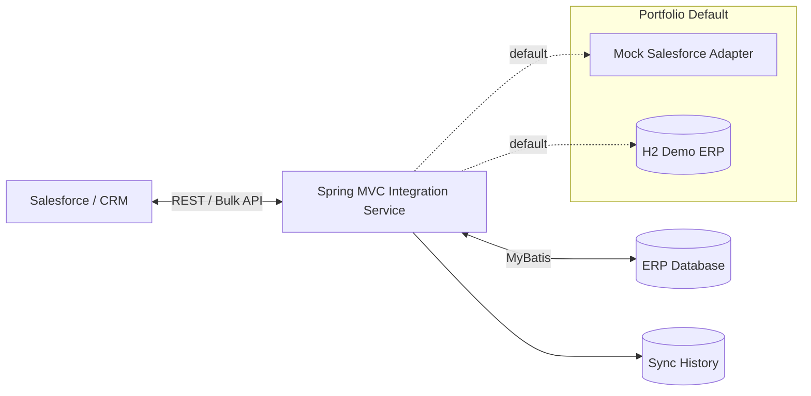
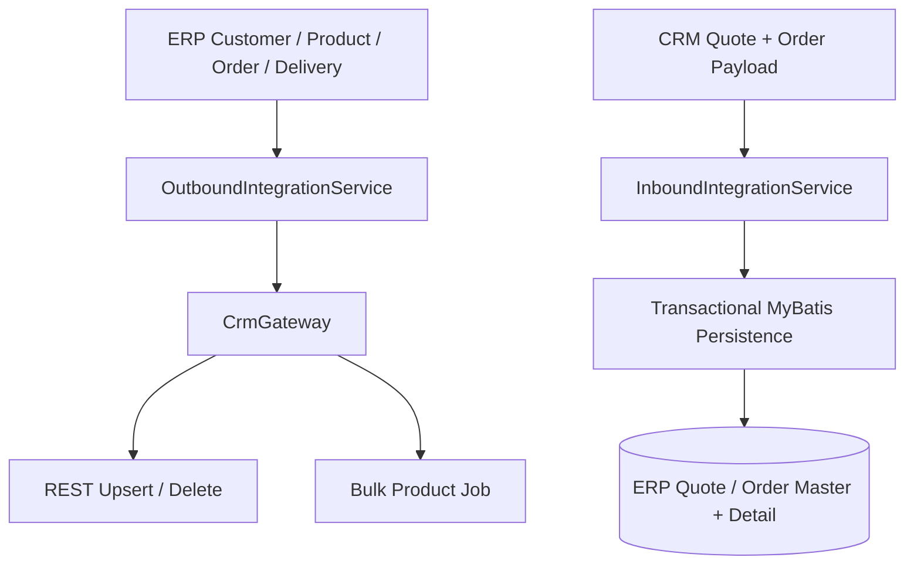
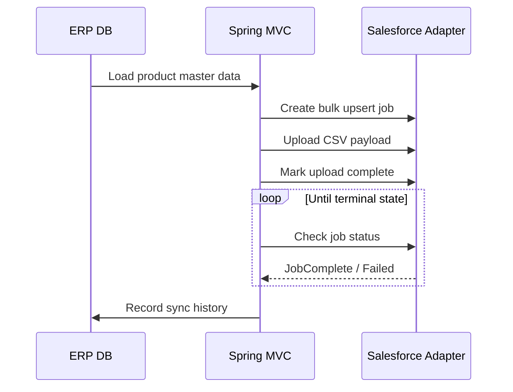
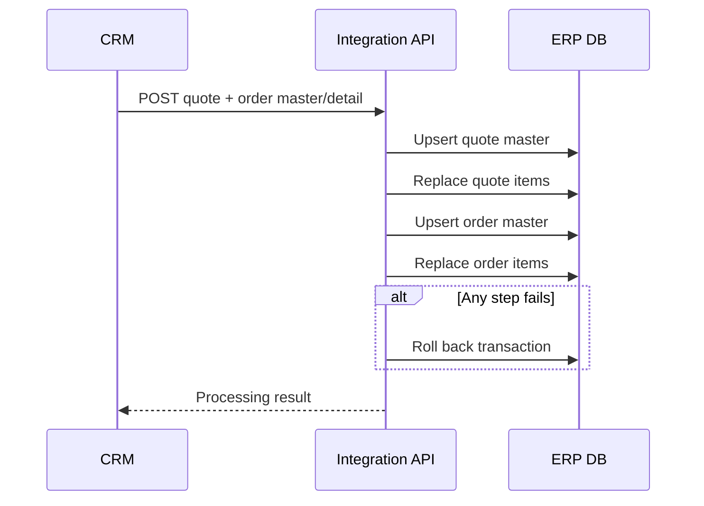

# ERP ↔ Salesforce Integration Platform

> **Portfolio reconstruction** of an enterprise ERP–CRM integration project using classic Spring MVC, MyBatis and Salesforce-style REST/Bulk API adapters.

This repository is **not a copy of an employer's source code**. It was newly implemented for portfolio use based on integration patterns and technical experience from enterprise work. Company names, internal database objects, stored procedures, endpoints, credentials, customer data and Salesforce organization-specific metadata are intentionally excluded.

## What this project demonstrates

- Bidirectional **ERP ↔ CRM integration** without a frontend dependency
- Classic **Spring Framework / Spring MVC** application packaged as a WAR (not Spring Boot)
- **MyBatis** based ERP data access and transactional master/detail persistence
- CRM **REST upsert/delete** using external keys
- **Bulk API 2.0 style** product synchronization with job lifecycle handling
- Adapter abstraction so business logic is isolated from external CRM HTTP details
- Synchronization history for traceability
- A self-contained **H2 demo ERP** and **Mock Salesforce** adapter for reviewers
- Optional HTTP Salesforce adapter activated only by an explicit Spring profile and environment variables

## Architecture



### Integration directions



## Key workflows

### 1. ERP → CRM product bulk synchronization



### 2. CRM → ERP quote/order transaction



## Tech stack

| Area | Technology |
| --- | --- |
| Language | Java 11 |
| Framework | Spring Framework 5.3, Spring MVC |
| Persistence | MyBatis 3 |
| Demo DB | H2 (MSSQL compatibility mode) |
| Integration | Java HTTP Client, JSON, REST, Bulk API pattern |
| Build | Maven, WAR |
| Runtime | Jetty Maven Plugin or Tomcat 9 |
| Test | JUnit 5, Spring Test |
| CI | GitHub Actions |

The original work was performed in a legacy-style Java/Spring MVC environment. The public reconstruction targets Java 11 for easier local reproduction while deliberately preserving the **non-Boot Spring MVC + WAR + MyBatis architecture**.

## Run locally

Requirements: Java 11+ and Maven 3.8+.

```bash
mvn clean test
mvn jetty:run
```

Then verify:

```text
GET http://localhost:8080/api/health
GET http://localhost:8080/api
```

No Salesforce account or external database is required. The default runtime uses H2 and `MockSalesforceGateway`.

## Demo API

```bash
# Customer upsert: ERP -> CRM
curl -X POST http://localhost:8080/api/erp/customers/CUST-1001/sync

# Product bulk job: ERP -> CRM
curl -X POST http://localhost:8080/api/erp/products/bulk-sync

# Order upsert: ERP -> CRM
curl -X POST http://localhost:8080/api/erp/orders/SO-2026-0001/sync

# Delivery upsert: ERP -> CRM
curl -X POST http://localhost:8080/api/erp/deliveries/DLV-2026-0001/sync

# Inspect the mock Salesforce state
curl http://localhost:8080/api/demo/crm-state

# Synchronization audit history
curl http://localhost:8080/api/erp/sync-history
```

A ready-to-use CRM → ERP request example is available in [`docs/api.md`](docs/api.md). For a short code-review path, see [`docs/reviewer-guide.md`](docs/reviewer-guide.md).

## Package for Tomcat

```bash
mvn clean package
```

Deploy `target/erp-salesforce-integration.war` to Tomcat 9.

## Optional real Salesforce adapter

The default project **never connects to Salesforce**. `SalesforceHttpGateway` is activated only with the Spring profile `salesforce` and credentials supplied externally. It demonstrates OAuth, external-ID REST upsert/delete and the Bulk API job lifecycle; target-organization object/field mappings must be adapted before real use.

Example JVM option:

```bash
-Dspring.profiles.active=salesforce
```

See [`.env.example`](.env.example) for variable names. Never commit real credentials.

## Repository structure

```text
src/main/java/dev/portfolio/integration
├── controller     REST endpoints
├── service        Integration orchestration / transactions
├── repository     MyBatis mapper interfaces
├── gateway        Mock + optional Salesforce adapters
├── model          ERP domain models
└── dto            API / integration results

src/main/resources
├── db             Demo ERP schema and seed data
├── mapper         MyBatis SQL mappings
└── spring         Classic Spring XML configuration
```

## Design decisions

**External-ID upsert** prevents duplicate CRM objects when the same ERP event is retried. **Gateway abstraction** keeps CRM HTTP mechanics out of services. **Bulk sync** is separated from single-record REST flows because job-based APIs have different state and error handling. **Transactional inbound processing** keeps quote and order master/detail data consistent. **Sync history** makes asynchronous/integration failures traceable.

## Security / confidentiality

This repository contains no original enterprise source code, internal IP addresses, credentials, customer information, proprietary SQL, Salesforce organization IDs, or company-specific custom object/field names. See [SECURITY.md](SECURITY.md).

## Portfolio note

For a concise Korean project description suitable for a resume or portfolio document, see [PORTFOLIO.md](PORTFOLIO.md).
